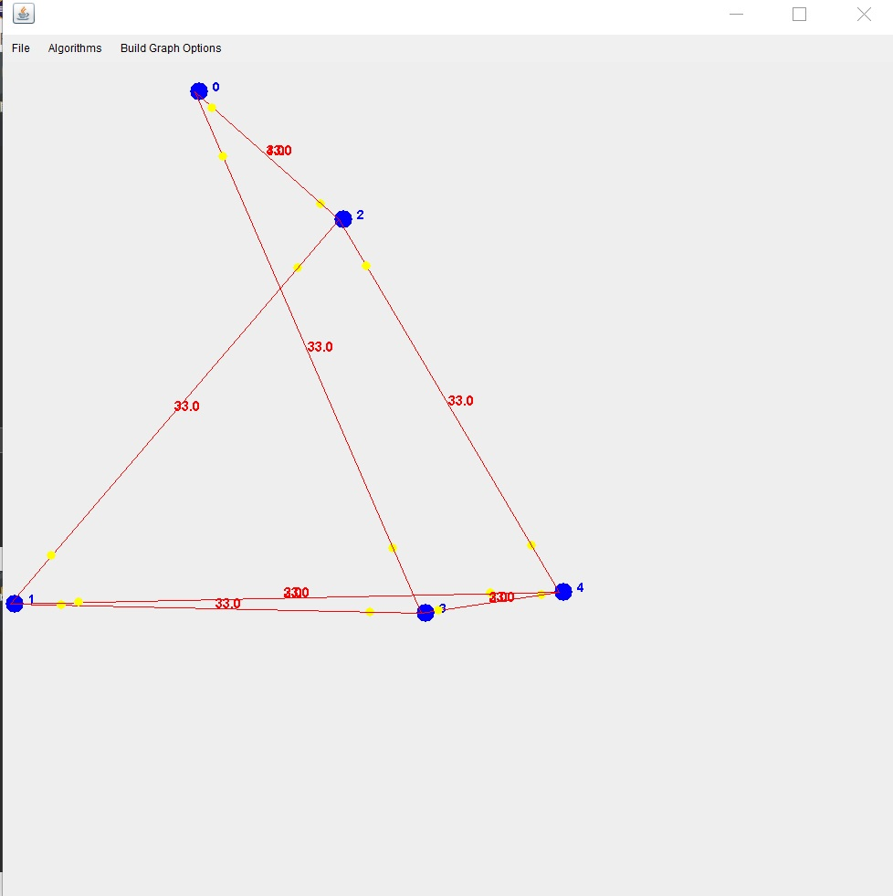

# OOP-Ex2

# THE MAZE OF WAZE

### This project is an implementation of a directional weighted graph , mathematical algorithms and a graphic interface (GUI) of a graph

Example:

>Node Class

This class represents a vertex on a Graph  and initiates it with five parameters
- Int Key- ID, is given by user
- Point3D Location- of object Point3D, receives a random X & Y value
- Weight- DOUBLE.Positive.Infinity
- Info- null
- Tag- -1

>Edge Class

This class represents an edge between to vertices (Vertex source, Vertex destination) and a Weight between them
- source, destination and weight is given by the user

>DGraph Class

This class represents a directional weighted graph. The class has a road-system or communication network in mind 

>GraphAlgo Class

This class represents the set of graph-theory algorithms. Follows the Diaxtra algorithm

>Gui_Graph Class

This class represent a graphic interface of a graph. For drawing functions on graph we used JFRAM based on swing and awt Libraries. Operations that are applicable on it including:
